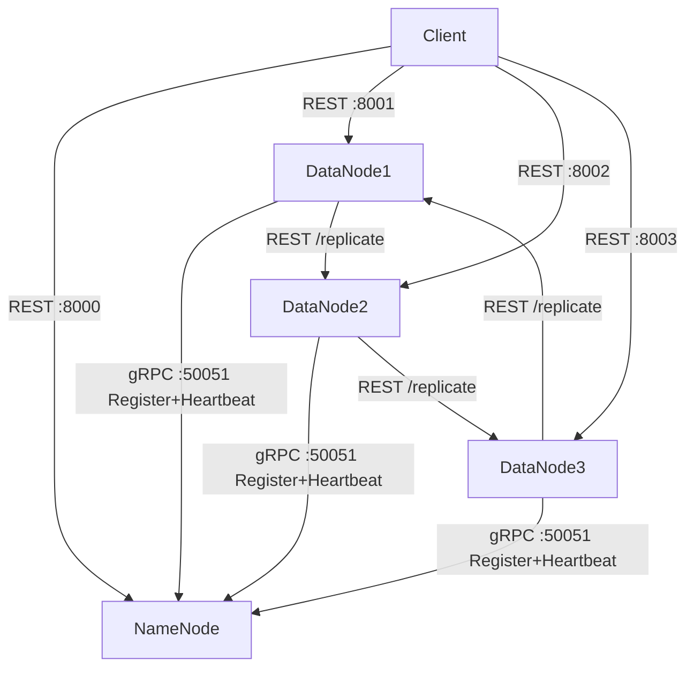

# Distributed File System (DFS)

A minimalist, block-based distributed file system inspired by HDFS/GFS, built entirely in Python with Docker. Files are split into fixed-size blocks, each block is stored on a primary DataNode and synchronously replicated to a secondary DataNode. A central NameNode tracks all metadata; three DataNodes handle physical storage.

---

## Architecture



| Component | Role | Port |
|-----------|------|------|
| NameNode | Metadata only (no data). Stores file → block mapping and datanode registry in `metadata.json`. Exposes REST + gRPC. | `8000` (REST), `50051` (gRPC) |
| DataNode ×3 | Physical block storage as `/blocks/{id}.bin`. Registers with NameNode on startup and sends heartbeat every 10 s. | `8001`, `8002`, `8003` |
| Client CLI | Talks to NameNode for metadata and directly to DataNodes for block I/O. | — |

**Replication model:** when the client writes a block to the primary DataNode, the primary immediately forwards a copy to the replica DataNode before confirming success. Both nodes are chosen by the NameNode at upload-begin time using round-robin across all ALIVE nodes.

---

## Prerequisites

- Docker Engine ≥ 24 and Docker Compose v2 (`docker compose version`)
- No local Python installation required — everything runs inside containers

---

## Repository Structure

```
dfs-project/
├── namenode/
│   ├── main.py            FastAPI REST + gRPC server + background threads
│   ├── Dockerfile
│   ├── requirements.txt
│   ├── dfs_pb2.py         Generated protobuf stubs
│   ├── dfs_pb2_grpc.py
│   └── proto/
│       └── dfs.proto
├── datanode/
│   ├── main.py            FastAPI block I/O + gRPC client (Register + Heartbeat)
│   ├── Dockerfile
│   ├── requirements.txt
│   ├── dfs_pb2.py         Same generated stubs (copied from namenode)
│   └── dfs_pb2_grpc.py
├── client/
│   └── cli.py             Click CLI — put / get / ls / rm / mkdir
├── examples/
│   └── metadata.seed.json Test user "juan" + three pre-registered DataNode stubs
├── data/                  Runtime volumes (gitignored)
│   ├── namenode/          metadata.json persisted here
│   ├── dn1/               DataNode 1 block files
│   ├── dn2/               DataNode 2 block files
│   └── dn3/               DataNode 3 block files
└── docker-compose.yml
```

---

## Quick Start — Full Stack

> **Critical:** copy the seed metadata **before** the first `docker compose up`. If the NameNode starts with an empty `data/namenode/` directory it creates a default `metadata.json` with no users, and login will fail with 401.

```bash
# 1. Enter the project directory
cd dfs-project

# 2. Seed metadata (user "juan" + three datanode stubs)
cp examples/metadata.seed.json data/namenode/metadata.json

# 3. Build images and start all four services
docker compose up --build
```

Once all containers are running, verify health:

```bash
curl -s http://127.0.0.1:8000/health   # NameNode
curl -s http://127.0.0.1:8001/health   # DataNode 1
curl -s http://127.0.0.1:8002/health   # DataNode 2
curl -s http://127.0.0.1:8003/health   # DataNode 3
```

Expected response from each:
```json
{"status": "ok"}
```

> If you already started without the seed and see `"users": {}` in `data/namenode/metadata.json`, fix it with:
> ```bash
> cp examples/metadata.seed.json data/namenode/metadata.json
> docker compose restart namenode
> ```

---

## Environment Variables

### NameNode

| Variable | Default | Description |
|----------|---------|-------------|
| `BLOCK_SIZE` | `1024` | Block size in bytes. Use `1024` for development, `67108864` (64 MB) for production. |
| `METADATA_PATH` | `/data/metadata.json` | Absolute path where metadata is persisted inside the container. |
| `HEARTBEAT_TIMEOUT_SEC` | `30` | Seconds without a heartbeat before a DataNode is marked `DEAD`. |
| `PENDING_TTL_SEC` | `300` | Seconds before a `PENDING` upload is garbage-collected. |
| `GRPC_PORT` | `50051` | Port the gRPC server listens on. |

### DataNode (applies to each of the three instances)

| Variable | Default | Description |
|----------|---------|-------------|
| `NODE_ID` | `dn-unknown` | Unique identifier registered with the NameNode (`dn1`, `dn2`, `dn3`). |
| `NAMENODE_HOST` | `namenode` | Hostname of the NameNode (Docker service name). |
| `NAMENODE_GRPC_PORT` | `50051` | gRPC port to reach the NameNode. |
| `DATANODE_PORT` | `8001` | REST port this DataNode advertises to peers and clients. |
| `BLOCK_SIZE` | `1024` | Must match the NameNode value. |

---

## NameNode REST API

Base URL: `http://127.0.0.1:8000`

| Method | Path | Request Body | Description |
|--------|------|-------------|-------------|
| `GET` | `/health` | — | Liveness probe. Returns `{"status": "ok"}`. |
| `POST` | `/login` | `{"username": "...", "password": "..."}` | Validates credentials against `metadata.json`. Returns `{"ok": true}` or 401. |
| `POST` | `/upload/begin` | `{"filename": "/user/path", "size": <bytes>, "username": "..."}` | Creates a `PENDING` file entry and returns block assignment (primary + replica per block). Returns 503 if fewer than 2 ALIVE DataNodes. |
| `POST` | `/upload/confirm` | `{"filename": "/user/path", "username": "..."}` | Transitions file from `PENDING` → `READY`. |
| `POST` | `/upload/abort` | `{"filename": "/user/path", "username": "..."}` | Deletes blocks on DataNodes (best-effort) and removes the `PENDING` entry. |
| `GET` | `/download/{filename}` | — | Returns file size and block list (index, primary, replica) for `READY` files. |
| `GET` | `/ls/{path}` | — | Lists immediate children of a directory prefix (files and subdirectories). |
| `DELETE` | `/rm/{filename}` | — | Deletes blocks on DataNodes (best-effort) and removes the file metadata. |
| `POST` | `/mkdir` | `{"path": "/user/dir", "username": "..."}` | Registers a directory path. Returns 409 if it already exists. |

---

## DataNode REST API

Base URL per node: `http://127.0.0.1:800{1,2,3}`

| Method | Path | Key Headers | Description |
|--------|------|-------------|-------------|
| `GET` | `/health` | — | Returns `{"status": "ok", "node_id": "dn1"}`. |
| `POST` | `/block/{id}` | `X-Replica-Host`, `X-Replica-Port` | **Primary write.** Saves raw body bytes to disk, then POSTs a copy to `/replicate` on the replica. Returns 500 if replication fails. |
| `POST` | `/replicate` | `X-Block-Id` (required) | **Replica write.** Saves bytes locally only — does not chain further. |
| `GET` | `/block/{id}` | — | Returns raw block bytes (`application/octet-stream`). 404 if missing, 500 if empty/corrupt. |
| `DELETE` | `/block/{id}` | — | Idempotent delete. Returns 200 even if the block did not exist. |

---

## gRPC Protocol

**Service:** `dfs.NameNodeService`  
**Port:** `50051`  
**Proto:** `namenode/proto/dfs.proto`

```protobuf
service NameNodeService {
  rpc Register  (RegisterRequest)  returns (RegisterResponse);
  rpc Heartbeat (HeartbeatRequest) returns (HeartbeatResponse);
}

message RegisterRequest  { string node_id = 1; string host = 2; int32 port = 3; }
message RegisterResponse { bool success = 1; }

message HeartbeatRequest {
  string node_id = 1;
  int64  free_bytes = 2;
  repeated string block_ids = 3;
}
message HeartbeatResponse { bool ok = 1; }
```

Each DataNode calls `Register` once on startup (retries every 5 s, up to 12 attempts = 1 minute). After successful registration it sends `Heartbeat` every 10 seconds with its current disk free space and the list of block IDs it holds. The NameNode marks a node `DEAD` if no heartbeat arrives within `HEARTBEAT_TIMEOUT_SEC` and automatically re-replicates any under-replicated blocks to healthy nodes.

---

## Step-by-Step Testing with curl

Run these commands in order after `docker compose up --build`. They form a complete upload → read → delete cycle.

### 1. Health check

```bash
curl -s http://127.0.0.1:8000/health
curl -s http://127.0.0.1:8001/health
curl -s http://127.0.0.1:8002/health
curl -s http://127.0.0.1:8003/health
```

### 2. Login

```bash
curl -s -X POST http://127.0.0.1:8000/login \
  -H 'Content-Type: application/json' \
  -d '{"username":"juan","password":"contrasena123"}'
# Expected: {"ok":true}
```

### 3. Create a directory

```bash
curl -s -X POST http://127.0.0.1:8000/mkdir \
  -H 'Content-Type: application/json' \
  -d '{"path":"/juan/docs","username":"juan"}'
# Expected: {"ok":true,"path":"/juan/docs"}
```

### 4. Begin upload (multi-block at BLOCK_SIZE=1024)

A 2500-byte file with `BLOCK_SIZE=1024` produces 3 blocks. The response contains block assignments — note the `primary` and `replica` node IDs for each block.

```bash
curl -s -X POST http://127.0.0.1:8000/upload/begin \
  -H 'Content-Type: application/json' \
  -d '{"filename":"/juan/docs/test.txt","size":2500,"username":"juan"}'
```

Expected response (block IDs and node assignments will vary):
```json
{
  "filename": "/juan/docs/test.txt",
  "block_size": 1024,
  "blocks": [
    {"id": "a1b2c3", "index": 0, "primary": "dn1", "replica": "dn2"},
    {"id": "d4e5f6", "index": 1, "primary": "dn2", "replica": "dn3"},
    {"id": "g7h8i9", "index": 2, "primary": "dn3", "replica": "dn1"}
  ]
}
```

### 5. Write blocks to DataNodes (with replication)

Use the block IDs and node assignments from the previous response. The DataNode maps for host lookup:

| Node ID | Host (Docker) | Host (from host machine) | Port |
|---------|--------------|--------------------------|------|
| `dn1` | `datanode1` | `127.0.0.1` | `8001` |
| `dn2` | `datanode2` | `127.0.0.1` | `8002` |
| `dn3` | `datanode3` | `127.0.0.1` | `8003` |

> When calling from your **host machine**, use `127.0.0.1` as the replica host header. Replace the port numbers according to each block's primary/replica assignment.

```bash
# Block 0: primary=dn1 (8001), replica=dn2 (8002)
echo -n "block-zero-data-padded-to-1024" | curl -s -X POST http://127.0.0.1:8001/block/a1b2c3 \
  -H "X-Replica-Host: 127.0.0.1" \
  -H "X-Replica-Port: 8002" \
  --data-binary @-

# Block 1: primary=dn2 (8002), replica=dn3 (8003)
echo -n "block-one-data-padded-to-1024" | curl -s -X POST http://127.0.0.1:8002/block/d4e5f6 \
  -H "X-Replica-Host: 127.0.0.1" \
  -H "X-Replica-Port: 8003" \
  --data-binary @-

# Block 2: primary=dn3 (8003), replica=dn1 (8001)
echo -n "block-two-data-padded-to-1024" | curl -s -X POST http://127.0.0.1:8003/block/g7h8i9 \
  -H "X-Replica-Host: 127.0.0.1" \
  -H "X-Replica-Port: 8001" \
  --data-binary @-
```

Each returns: `{"block_id": "...", "size": <bytes>}`

### 6. Confirm upload

```bash
curl -s -X POST http://127.0.0.1:8000/upload/confirm \
  -H 'Content-Type: application/json' \
  -d '{"filename":"/juan/docs/test.txt","username":"juan"}'
# Expected: {"ok":true}
```

### 7. Download metadata (verify block placement)

```bash
curl -s http://127.0.0.1:8000/download/juan/docs/test.txt
```

Expected: JSON with `filename`, `size`, and `blocks` array in index order.

### 8. Read a block — verify replication

```bash
# Read from primary (dn1)
curl -s http://127.0.0.1:8001/block/a1b2c3

# Read same block from replica (dn2) — must return identical bytes
curl -s http://127.0.0.1:8002/block/a1b2c3
```

### 9. List directory

```bash
curl -s http://127.0.0.1:8000/ls/juan/docs
# Expected: {"path":"/juan/docs","entries":["test.txt"]}

curl -s http://127.0.0.1:8000/ls/juan
# Expected: {"path":"/juan","entries":["docs/"]}
```

### 10. Delete file

```bash
curl -s -X DELETE http://127.0.0.1:8000/rm/juan/docs/test.txt
# Expected: {"ok":true}

# Verify it is gone
curl -s http://127.0.0.1:8000/download/juan/docs/test.txt
# Expected: 404
```

### 11. Delete a block directly (verify idempotency)

```bash
# First call — block may already be gone from step 10
curl -s -X DELETE http://127.0.0.1:8001/block/a1b2c3
# Expected: {"block_id":"a1b2c3","deleted":true}

# Second call — must still return 200
curl -s -X DELETE http://127.0.0.1:8001/block/a1b2c3
# Expected: {"block_id":"a1b2c3","deleted":true}
```

### 12. Abort a pending upload

```bash
# Start an upload but do NOT confirm it
curl -s -X POST http://127.0.0.1:8000/upload/begin \
  -H 'Content-Type: application/json' \
  -d '{"filename":"/juan/pending.bin","size":100,"username":"juan"}'

# Abort — cleans up blocks and removes the PENDING entry
curl -s -X POST http://127.0.0.1:8000/upload/abort \
  -H 'Content-Type: application/json' \
  -d '{"filename":"/juan/pending.bin","username":"juan"}'
# Expected: {"ok":true}
```

---

## CLI Usage

The CLI requires the NameNode address and credentials on every call.

```bash
# Upload a local file to the DFS
python client/cli.py --host localhost --port 8000 --user juan --pass contrasena123 \
  put local.txt /juan/docs/local.txt

# Download a file from the DFS
python client/cli.py --host localhost --port 8000 --user juan --pass contrasena123 \
  get /juan/docs/local.txt output.txt

# List a directory
python client/cli.py --host localhost --port 8000 --user juan --pass contrasena123 \
  ls /juan/docs

# Delete a file
python client/cli.py --host localhost --port 8000 --user juan --pass contrasena123 \
  rm /juan/docs/local.txt

# Create a directory
python client/cli.py --host localhost --port 8000 --user juan --pass contrasena123 \
  mkdir /juan/archive
```

> The CLI depends on a `dfs_client` module (Persona 3). Ensure `client/dfs_client.py` exists and the required packages (`click`, `requests`, `tqdm`) are installed before running outside Docker.

---

## Development vs Production Configuration

Change these values in `docker-compose.yml` — no code changes required.

| Setting | Development (default) | Production |
|---------|-----------------------|------------|
| `BLOCK_SIZE` | `1024` (1 KB) — lets you observe multi-block splits on small files | `67108864` (64 MB) |
| `HEARTBEAT_TIMEOUT_SEC` | `30` | `30` (keep; increase only on slow networks) |

To switch to production block size, edit each service in `docker-compose.yml`:

```yaml
environment:
  - BLOCK_SIZE=67108864
```

Then rebuild:

```bash
docker compose up --build
```

---

## Troubleshooting

| Symptom | Cause | Fix |
|---------|-------|-----|
| `POST /upload/begin` → 503 | Fewer than 2 DataNodes in `ALIVE` state | Wait for DataNodes to register, or check `docker compose logs datanode1` for gRPC errors |
| `POST /login` → 401 `Invalid credentials` | `metadata.json` was created without the seed (empty `users`) | `cp examples/metadata.seed.json data/namenode/metadata.json` then `docker compose restart namenode` |
| DataNode container exits immediately | Could not reach NameNode gRPC after 12 retries (1 minute) | Ensure `namenode` is healthy first; check `NAMENODE_HOST` and `NAMENODE_GRPC_PORT` env vars |
| `POST /block/{id}` → 500 `replication failed` | Replica DataNode unreachable | Check that `X-Replica-Host` and `X-Replica-Port` point to the correct host from the caller's perspective (use `127.0.0.1` when calling from the host machine) |
| Port already in use | Another process is bound to `8000`, `8001`, `8002`, `8003`, or `50051` | Change the host-side port mapping in `docker-compose.yml` (e.g. `"18001:8001"`) |
| Volume permission errors | The `data/` directories are not writable by the container user | `chmod -R 777 data/` or run `docker compose up` with a user that owns the directory |
| `GET /block/{id}` → 500 `empty or corrupt` | Block file exists but has zero bytes (interrupted write) | Delete the block manually: `curl -X DELETE http://127.0.0.1:800X/block/{id}` and re-upload |
